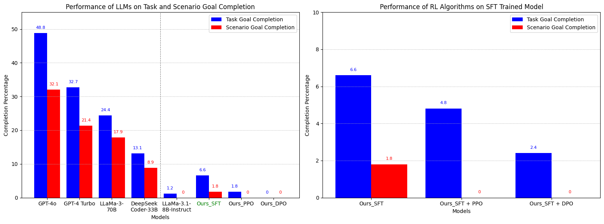

# Better Agent for AppWorld

This project explores enhancing Large Language Model (LLM) performance in the AppWorld environment through supervised fine-tuning (SFT) and reinforcement learning with human feedback (RLHF). We focus on improving small scale agent (LLaMA-3.1 8B Instruct) performance beyond zero-shot capabilities using the AppWorld benchmark for complex API calls and interactive coding tasks.

## Overview

Our project implements and evaluates three main approaches:
- Supervised Fine-Tuning (SFT)
- Reinforcement Learning with Human Feedback (RLHF) using PPO
- Reinforcement Learning with Human Feedback (RLHF) using DPO
- Hybrid approaches combining SFT with PPO and DPO

### Key Results

- SFT model achieved significant improvements over the baseline:
  - 6.6% Task Goal Completion (TGC)
  - 1.8% Scenario Goal Completion (SGC)
  - Best performance at Difficulty Level 1 with 15.8% TGC
- RLHF models showed modest improvements:
  - PPO: 1.8% aggregate TGC
  - DPO: Limited success across metrics
- Hybrid SFT+RL models performed below standalone SFT




## Project Structure

```
├── data/
│   ├── appworld_sft/
│   └── appworld_rlhf/
├── models/
│   ├── sft/
│   ├── reward/
│   ├── ppo/
│   ├── dpo/
│   ├── sft_ppo/
│   └── sft_dpo/
├── evaluation/
│   └── benchmark.py
├── configs/
│   ├── sft_config.yaml
│   ├── reward_config.yaml
│   ├── ppo_config.yaml
│   ├── dpo_config.yaml
│   ├── sft_ppo_config.yaml
│   └── sft_dpo_config.yaml
├── assets/
│   └── Performance_comparison_conclusion.png
│   └── Task Goal Completion by Model and Difficulty.png
│   └── Task Goal Completion by Model and Difficulty2.png
│   └── Task Goal Completion by Model and Difficulty3.png
└── README.md
```

## Dataset

Our dataset includes:
- SFT Dataset: 446 curated instruction-response pairs
- RLHF Dataset: 434 annotated preference pairs

## Model Architecture

Base Model: LLaMA-3.1 8B Instruct
- Chosen for balanced scale and capability
- Instruction-tuned variant optimized for interactive tasks